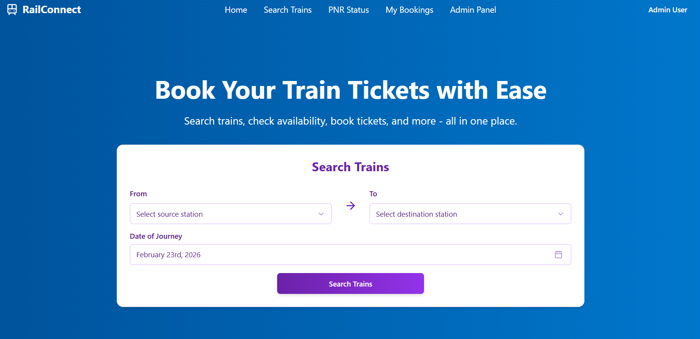
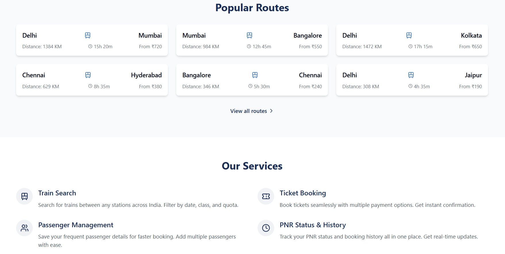
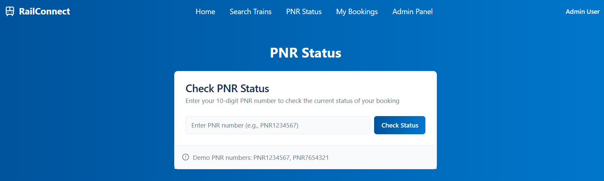
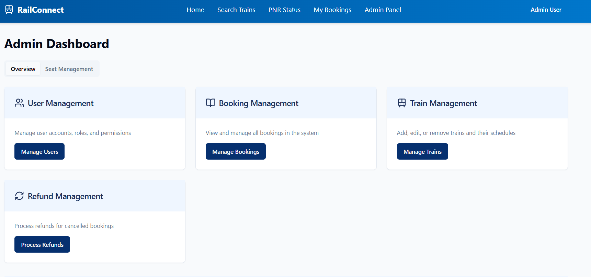

# 🚂 RailConnect - Track Route Connect

<div align="center">



**A modern, full-featured train booking and management system built with React, TypeScript, and Vite**

[](https://reactjs.org/)
[](https://www.typescriptlang.org/)
[](https://vitejs.dev/)
[](https://tailwindcss.com/)

[Features](#-features) • [Screenshots](#-screenshots) • [Quick Start](#-quick-start) • [Tech Stack](#-tech-stack) • [Contributing](#-contributing)

</div>

---

## 📖 About

RailConnect is a comprehensive railway reservation system that allows users to search trains, book tickets, manage bookings, and check PNR status. It includes a powerful admin panel for managing users, bookings, trains, and refunds.

---

## ✨ Features

### 👤 User Features
- **🔍 Train Search** - Search for trains between any stations across India with filters for date, class, and quota
- **🎫 Ticket Booking** - Seamless ticket booking with multiple payment options and instant confirmation
- **📱 PNR Status** - Real-time PNR status checking and booking history tracking
- **📋 My Bookings** - View and manage upcoming journeys and cancelled bookings
- **👥 Passenger Management** - Save frequent passenger details for faster booking
- **🗺️ Popular Routes** - Quick access to popular train routes with fare and duration information
- **🔐 User Authentication** - Secure login and registration system
- **👤 Profile Management** - Manage personal information and preferences

### 🛡️ Admin Features
- **📊 Admin Dashboard** - Comprehensive overview with key metrics and analytics
- **👥 User Management** - Manage user accounts, roles, and permissions
- **📖 Booking Management** - View and manage all bookings in the system
- **🚆 Train Management** - Add, edit, or remove trains and their schedules
- **💰 Refund Management** - Process refunds for cancelled bookings
- **💺 Seat Management** - Real-time seat availability and allocation tracking

---

## 🎨 Screenshots

### Home Page - Popular Routes & Services

*Browse popular train routes with distance, duration, and fare information*

### PNR Status Check

*Real-time PNR status checking with demo PNRs (PNR1234567, PNR7654321)*

### My Bookings

*Track upcoming journeys and view cancelled bookings*

### Admin Dashboard

*Comprehensive admin panel with user, booking, train, and refund management*

---

## 🚀 Quick Start

### Prerequisites

Ensure you have the following installed:

- **Node.js** (LTS version recommended)  
  Download: [https://nodejs.org](https://nodejs.org)

- **npm** or **bun** (package manager)  
  npm comes with Node.js, or install bun: [https://bun.sh](https://bun.sh)

- **Git**  
  Download: [https://git-scm.com](https://git-scm.com)

Verify installation:
```bash
node -v
npm -v
git --version
```

### Installation

1. **Clone the repository**
   ```bash
   git clone https://github.com/your-username/track-route-connect.git
   cd track-route-connect
   ```

2. **Install dependencies**
   ```bash
   npm install
   # or
   bun install
   ```

3. **Start development server**
   ```bash
   npm run dev
   # or
   bun dev
   ```

4. **Open in browser**
   ```
   http://localhost:5173
   ```

   Your application is now running! 🎉

---

## 🏗️ Build for Production

Create an optimized production build:

```bash
npm run build
```

Preview the production build locally:

```bash
npm run preview
```

---

## 🛠️ Tech Stack

### Frontend
- **React 18** - Modern UI library with hooks
- **TypeScript** - Type-safe JavaScript
- **Vite** - Lightning-fast build tool
- **React Router** - Client-side routing

### Styling & UI
- **Tailwind CSS** - Utility-first CSS framework
- **Shadcn/ui** - High-quality, accessible component library
- **Radix UI** - Unstyled, accessible UI primitives
- **Lucide Icons** - Beautiful, consistent icons

### State Management
- **React Context API** - Global state management
  - `AuthContext` - User authentication state
  - `BookingContext` - Booking flow state
  - `TrainContext` - Train data management

### Form Handling & Validation
- **React Hook Form** - Performant form management
- **Zod** - TypeScript-first schema validation

### Development Tools
- **ESLint** - Code linting
- **PostCSS** - CSS processing
- **TypeScript** - Static type checking

---

## 📁 Project Structure

```
track-route-connect/
├── src/
│   ├── components/          # React components
│   │   ├── ui/             # Shadcn UI components
│   │   ├── admin/          # Admin-specific components
│   │   ├── booking/        # Booking flow components
│   │   ├── Footer.tsx
│   │   ├── NavBar.tsx
│   │   ├── LoginForm.tsx
│   │   └── RegisterForm.tsx
│   ├── pages/              # Application pages/routes
│   │   ├── Index.tsx       # Home page
│   │   ├── Search.tsx      # Train search
│   │   ├── Booking.tsx     # Booking page
│   │   ├── PNR.tsx         # PNR status
│   │   ├── Admin.tsx       # Admin dashboard
│   │   └── ...
│   ├── context/            # React Context providers
│   │   ├── AuthContext.tsx
│   │   ├── BookingContext.tsx
│   │   └── TrainContext.tsx
│   ├── hooks/              # Custom React hooks
│   │   ├── use-toast.ts
│   │   ├── use-mobile.tsx
│   │   └── useAdminBookings.tsx
│   ├── lib/                # Utility functions
│   │   └── utils.ts
│   ├── data/               # Mock data & constants
│   │   └── mockData.ts
│   ├── App.tsx             # Main App component
│   └── main.tsx            # Application entry point
├── public/                 # Static assets
├── components.json         # Shadcn UI config
├── tailwind.config.ts      # Tailwind configuration
├── vite.config.ts          # Vite configuration
├── tsconfig.json           # TypeScript configuration
└── package.json            # Dependencies & scripts
```

---

## 🧪 Available Scripts

| Command | Description |
|---------|-------------|
| `npm run dev` | Start development server |
| `npm run build` | Build for production |
| `npm run preview` | Preview production build |
| `npm run lint` | Run ESLint |

---

## 🔧 Configuration

### Environment Variables

Create a `.env` file in the root directory (if needed):

```env
VITE_API_URL=your_api_url_here
VITE_APP_NAME=RailConnect
```

### Tailwind CSS

Customize colors, fonts, and other design tokens in [`tailwind.config.ts`](tailwind.config.ts).

### Component Library

Add new Shadcn UI components:

```bash
npx shadcn-ui@latest add button
npx shadcn-ui@latest add dialog
```

---

## 🎯 Key Features Explained

### Authentication System
- Secure login/registration flows
- Protected routes for authenticated users
- Admin role-based access control

### Booking Flow
1. Search trains by source, destination, and date
2. Select train and class
3. Add passenger details
4. Choose payment method
5. Get instant booking confirmation

### Admin Dashboard
- Overview tab with system metrics
- Seat management for real-time availability
- Complete CRUD operations for users, trains, and bookings
- Refund processing workflow

### Mock Data
The application uses mock data for demonstration. Check [`src/data/mockData.ts`](src/data/mockData.ts) for sample trains, bookings, and users.

---

## ❗ Troubleshooting

### Common Issues

**Port already in use**
```bash
npm run dev -- --port 3000
```

**Dependencies not installed**
```bash
rm -rf node_modules package-lock.json
npm install
```

**Build errors**
```bash
npm run lint
npm run build
```

**TypeScript errors**
```bash
npx tsc --noEmit
```

---

## 🤝 Contributing

Contributions are welcome! Please follow these steps:

1. **Fork the repository**

2. **Create a feature branch**
   ```bash
   git checkout -b feature/your-feature-name
   ```

3. **Make your changes**
   - Write clean, documented code
   - Follow existing code style
   - Add tests if applicable

4. **Commit your changes**
   ```bash
   git add .
   git commit -m "Add: description of your changes"
   ```

5. **Push to your fork**
   ```bash
   git push origin feature/your-feature-name
   ```

6. **Create a Pull Request**
   - Describe your changes
   - Reference any related issues

### Contribution Guidelines
- Use meaningful commit messages
- Follow the existing code structure
- Update documentation as needed
- Test your changes thoroughly

---

## 📝 Roadmap

- [ ] Backend API integration
- [ ] Real-time seat availability
- [ ] Payment gateway integration
- [ ] Email/SMS notifications
- [ ] Mobile responsive improvements
- [ ] PWA support
- [ ] Multi-language support
- [ ] Advanced analytics dashboard

---

## 📄 License

This project is open source and available under the **MIT License**.

---

## 👥 Authors

Made with ❤️ by contributors

---

## 🙏 Acknowledgments

- [Shadcn/ui](https://ui.shadcn.com/) - Beautiful component library
- [Tailwind CSS](https://tailwindcss.com/) - Styling framework
- [Radix UI](https://www.radix-ui.com/) - Accessible components
- [Lucide Icons](https://lucide.dev/) - Icon library

---

<div align="center">

**⭐ Star this repo if you find it helpful!**

[Report Bug](https://github.com/your-username/track-route-connect/issues) • [Request Feature](https://github.com/your-username/track-route-connect/issues)

</div>

